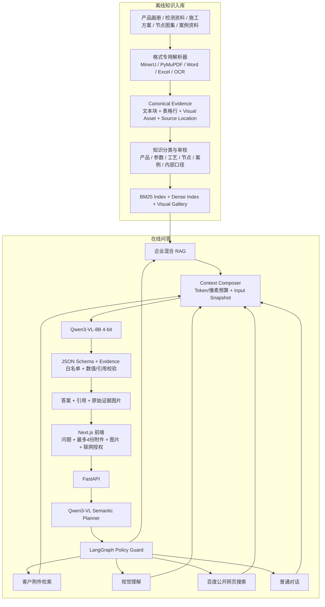

# 建材销售与技术支持多模态 RAG Agent

面向建材销售、售前咨询和工程技术支持的本地多模态知识助手。系统把分散在产品画册、检测资料、施工方案、节点图集、项目案例和客户临时附件中的信息，转换为可检索、可引用、可返回原图的证据；再由受约束 Agent 决定使用企业知识库、客户附件、视觉理解、普通对话或公开网页搜索。

> 本仓库是隐私清理后的公开核心版本，不包含模型权重、企业原始资料、客户文件、私有索引、API Key、生产地址、运行日志和未公开评测数据。


## 项目解决什么问题

建材业务的问题不是“缺一个聊天框”，而是资料形态复杂、检索结果难核对、图片与说明容易失联：

- PDF、Word、Excel、CSV、扫描件、节点图和现场图片无法统一检索；
- 同一产品在画册、检测报告和销售资料中的命名及粒度不同；
- 表格切块后容易丢失表头，图纸切块后容易丢失页码与邻近说明；
- 普通 RAG 容易返回语义相近但产品不匹配的图片；
- 多份文件可能重复、互补或冲突，不能简单取 Top-1；
- 企业资料和客户附件不能无边界发送给外部服务；
- 模型即使回答正确，也需要说明来自哪份文件、哪一页、哪个 Sheet 或哪张原图。

本项目将问题拆为可独立验证的六层：

```text
多格式解析 → Canonical Evidence → 混合检索 → Agent 工具规划
          → Grounded Generation → 引用回填与可信性校验
```

## 技术亮点

### 1. 保留原始结构的多格式解析

- **PDF**：逐页检测文本层；可可靠提取时优先直接解析，扫描、乱码或结构严重错位页面进入 OCR／版面分析／视觉回退。
- **Word**：分别保留标题、段落、表格、页眉页脚、评论和内嵌图片。
- **Excel/CSV**：按 Workbook、Sheet、局部表格、业务表头、数据行和单元格组织；将紧凑表头绑定到行值，避免字段名和值被切开。
- **图片与图表**：原图作为 Visual Asset 保存；OCR、版面模型和 VLM 结果只作为带来源的候选，不静默覆盖原始信息。

所有输入投影为统一的 **Canonical Evidence**，同时保留格式专用位置：PDF 的 `page + bbox`、Excel 的 `sheet + range`、Word 的段落／表格位置和图片的 `visual_asset_id`。

### 2. 文本、表格和图片可追溯

完整解析结果与单次模型输入分离：

- **Canonical Evidence** 保存完整原始结构；
- **Input Snapshot** 只保存该问题实际进入模型的文本窗口、图片、Token 预算和选择理由；
- 模型只能引用白名单内的 Evidence ID；
- 后端把 Evidence ID 物化为文档名、页码、Sheet、单元格范围和原始图片接口。

因此一次上下文压缩不会删除原文件信息，也可以区分“解析失败、检索漏召回、视觉页未进入输入、模型理解错误和引用校验失败”。

### 3. 混合检索与候选保真

企业知识库采用：

```text
BM25 词法召回
    + Qwen3-Embedding 本地向量召回
    → Reciprocal Rank Fusion
    → 显式保留 Lexical Top-8 / Dense-only Top-4
    → Qwen3-Reranker Cross-Encoder 重排
    → 任务与答案形态轻量加权
```

词法召回擅长产品型号、规范编号、节点名称和精确参数；向量召回补充同义表达。显式候选保留避免某一路的高质量结果在融合前被另一条召回流挤掉，并用共享 SHA 指纹验证词法与向量索引来自同一版证据快照。

### 4. 产品图片不是“文本 Top-K 的附属品”

产品图、案例图、节点图和工艺图分别标注视觉范围。模型 Planner 输出 `wants_visuals` 与 `visual_scope` 后，检索器按问题选择相关图库：

- 产品总览：从完整审核图库返回代表性产品图；
- 指定产品：只返回名称或别名明确匹配的产品图；
- 未匹配产品：返回 0 张并说明缺少资料，不拿相似产品替代；
- 案例／节点／工艺：结合标题、OCR、邻近文本、页码和已召回 Evidence 排序。

返回的是企业资料中的原始图片或原始裁剪，而不是模型重新绘制的示意图。

### 5. Model-first 的受约束 Agent

基于 LangGraph 构建有限状态 Agent。Qwen3-VL Planner 一次性输出工具选择、业务意图、任务类型、检索改写、视觉范围和是否需要联网；后端只保留少量安全边界：

- 客户附件存在时优先纳入证据；
- 未上传的私有动态数据不得猜测；
- 联网开关只是授权，不代表每轮都要搜索；
- 普通问候、改写和企业资料可回答的问题不消耗联网额度；
- 私有 Evidence 永不拼入公开搜索请求；
- Planner 失败时采用保守本地兜底。

可用工具：`general_chat`、`customer_documents`、`company_rag`、`visual_inspection`、`public_web_search`。

### 6. 少量异构文件的跨文件问答

客户单次最多上传 4 份文件。系统完整解析后，按问题对每份文件内部的页面、段落、表格行和图片进行召回，再在总 Token／像素预算下分配上下文。支持：

- `redundant`：多份文件重复支持同一结论；
- `complementary`：多份文件分别提供结论的一部分；
- `conflicting`：不同来源冲突，显式并列，不替用户拍板；
- `none`：候选均无足够证据，拒答。

长文本采用约 768 Token、96 Token 重叠的结构窗口；默认客户附件文本预算约 10k Token，并保留按文件配额、零相关干扰抑制和最多 4 张相关图片等安全限制。

### 7. 本地多模态推理适配 16GB GPU

- Qwen3-VL-8B-Instruct 使用 4-bit NF4、Batch Size 1；
- 生成模型加载前将 Embedding／Reranker 移到 CPU，避免三模型同时争抢显存；
- 对文本 Token、图片数量、总像素和生成长度设置预算；
- 推理结束不保存 hidden states、attention 或生成分数；
- 默认空闲 10 分钟卸载生成模型，检索服务仍可运行。

这不是简单降低模型尺寸，而是通过模型生命周期管理在消费级显卡上保留完整 8B 多模态能力。

### 8. 可控联网补充

公开网页搜索只处理确实依赖时效性外部事实的问题。当前设计包含：

- 问题级语义决策，而不是勾选联网后每轮强制调用；
- 搜索结果相关性、来源域名和时效重排；
- 对高价值页面做受限抓取与证据片段验证；
- 本地 SQLite 缓存和每日业务／硬额度隔离；
- 联网结果只能作为公开参考，不能证明企业产品参数。

## 完整架构



详细数据流、组件职责和状态机见 [docs/ARCHITECTURE.md](docs/ARCHITECTURE.md)，检索与视觉算法见 [docs/ALGORITHMS.md](docs/ALGORITHMS.md)。

## 技术栈

| 层 | 技术 |
|---|---|
| 前端 | Next.js 16、React 19、TypeScript、静态导出 |
| API / 工作流 | FastAPI、Pydantic、LangGraph |
| 多模态模型 | Qwen3-VL-8B-Instruct、bitsandbytes 4-bit NF4 |
| 文档解析 | MinerU、PyMuPDF、pypdf、python-docx、openpyxl、xlrd、OCR/PP-Structure 可选 |
| 检索 | BM25、Qwen3-Embedding-0.6B、RRF、Qwen3-Reranker-0.6B |
| 部署 | 腾讯云静态网站托管、Tailscale HTTPS 私网入口、本地 GPU FastAPI |
| 质量保障 | CPU 回归测试、Evidence 审计、输入快照、结构化输出校验 |

## 项目结构

```text
backend/
├─ app.py                     # FastAPI、模型生命周期、Grounded回答与校验
├─ document_parsing/          # PDF/Word/Excel/图片等格式解析
├─ documents/                 # 附件会话、Canonical Evidence、跨文件检索
└─ sales/
   ├─ tool_planner.py         # 模型语义计划与安全裁剪
   ├─ answer_graph.py         # LangGraph 有限状态 Agent
   ├─ retriever.py            # BM25 / Dense / RRF / Rerank / Visual Retrieval
   ├─ dense_retrieval.py      # 本地 Embedding、Reranker 与 GPU 生命周期
   ├─ baidu_search.py         # 配额、缓存、来源重排与页面验证
   └─ ingestion_graph.py      # 审核优先的企业资料入库

scripts/                      # 索引、视觉资产、知识分类与入库工具
frontend/                     # 中文 Web 前端
data/                         # 仅保留公开配置和空目录
docs/                         # 架构、算法、评测和简历说明
```

## 当前验证状态

| 项目 | 当前结果 | 说明 |
|---|---:|---|
| 建材知识评测草案 | 100 题 | 70 文字 RAG、20 客户图片直读、10 拒答 |
| 严格 Evidence Recall@5 | 65/70（92.86%） | 只认同一 Evidence ID；不是最终答案准确率 |
| 图片题原始资产可用率 | 20/20 | 评测给定图片后的视觉理解，不等同图库召回 |
| CPU 回归测试 | 112 项通过 | 覆盖销售路由、Evidence、混合召回及产品图库等核心逻辑 |

评测集仍处于 `human_review_draft`，上述数字用于工程诊断，不作为未经审核的业务效果宣传。评测协议与指标见 [docs/EVALUATION.md](docs/EVALUATION.md)。

## 快速开始

### 环境

- Python 3.10+
- Node.js 22+
- NVIDIA GPU；8B 4-bit 建议约 16GB 显存
- 本地 Qwen3-VL-8B-Instruct 权重

```bash
python -m venv .venv
# Windows: .venv\Scripts\activate
# Linux/macOS: source .venv/bin/activate
pip install -r requirements.txt
```

复制 `.env.example` 为 `.env`，至少设置：

```text
FACADE_MODEL_PATH=/absolute/path/to/Qwen3-VL-8B-Instruct
FACADE_PUBLIC_FRONTEND=http://localhost:3000
```

启动后端：

```bash
uvicorn backend.app:app --host 127.0.0.1 --port 8000 --env-file .env
```

启动前端：

```bash
cd frontend
npm install
npm run dev
```

生产前端可静态导出到腾讯云；后端建议只通过 VPN／Tailscale 或身份认证网关访问，不直接暴露模型端口。

## 公开仓库边界

本仓库公开的是架构、核心代码和可复现的工程方法。以下内容有意排除：企业产品原文、客户附件、私有索引、生产域名、API 密钥、模型权重和内部运行日志。构建自己的知识库时，请把已授权资料放入 `data/sales/raw/`，完成解析与人工审核后再生成本地索引。

## 简历与面试

可直接使用的简历精简版、详细版和面试讲解见 [docs/RESUME.md](docs/RESUME.md)。版本变化见 [CHANGELOG.md](CHANGELOG.md)。

## License

[MIT](LICENSE)。企业资料、模型权重和第三方数据不属于本许可证范围。
