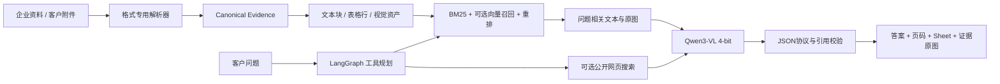

# 建材销售与技术支持多模态 RAG Agent

面向建材销售、售前咨询和工程技术支持的本地多模态知识助手。系统能够解析企业产品手册、施工方案、技术规范、节点图集，以及客户临时上传的 PDF、Word、Excel 和图片；通过可追溯证据检索，让模型回答“依据来自哪份文件、哪一页、哪个 Sheet、哪张原图”。

> 本仓库是可公开发布的代码版本，不包含模型权重、企业原始资料、客户文件、密钥、运行日志和私有评测数据。


## 解决的问题

建材企业的产品参数、施工方法、节点图纸和项目案例往往分散在多份手册、规范和内部文件中。传统关键词搜索存在以下问题：

- PDF、Word、Excel、扫描件和图片格式不统一；
- 表格字段、页码、节点图与附近说明容易在解析后失去关联；
- 模型可能根据常识回答，却无法证明答案来自企业资料；
- 多文件内容重复、互补或冲突时，简单 Top-1 检索难以处理；
- 私有产品资料不适合发送到外部大模型服务。

本项目将其拆成“文档结构化、证据检索、工具路由、受约束生成、引用回填”五个可独立评测的阶段。

## 核心特点

### 1. 多格式结构化解析

- PDF：逐页检测文本层质量，正常页面直接解析；扫描、乱码或表格结构恢复失败页面进入视觉回退。
- Word：分别保留标题、段落、嵌套表格和内嵌图片。
- Excel/CSV：按 Workbook、Sheet、表格、表头、数据行和单元格组织，避免字段名和值被切到不同窗口。
- 图片：保留原图字节、媒体类型、哈希和视觉候选，不把低置信度 OCR 静默当成事实。

所有格式最终投影为统一 Evidence 协议，但仍保留各格式专用位置：`page + bbox`、`sheet + range`、段落/章节和视觉资产 ID。

### 2. 可追溯多模态 RAG

企业知识库支持 BM25 召回，并可选启用本地向量召回与交叉编码器重排。图集中的图片或表格截图单独建立视觉索引，并与同页标题、说明文字、页码和裁剪区域绑定。

模型返回的不是重绘图片，而是原始资料中的证据裁剪，同时显示：

- 文档名称；
- 原始页码或 Sheet/单元格范围；
- 原始图片；
- 与图片关联的文字证据。

### 3. 小规模跨文件问答

客户一次可上传最多 4 份文件。系统先完整解析每份文件，再针对问题从每份文件保留至少一个候选证据，随后跨文件竞争剩余上下文预算，避免某一份长文件占满输入。

系统支持四种证据关系：

- `redundant`：多份文件重复支持同一结论；
- `complementary`：不同文件分别提供结论所需的信息；
- `conflicting`：来源之间存在冲突，必须显式提示；
- `none`：证据不足，拒绝给出确定结论。

### 4. 受约束 Agent 工具路由

基于 LangGraph 构建有限状态工作流，模型只负责理解问题和提出工具计划，后端规则负责授权和执行。可选工具包括：

- 客户临时附件检索；
- 企业本地知识库；
- Qwen3-VL 视觉理解；
- 公开网页搜索；
- 普通对话。

私有附件不会拼接到联网搜索请求中；联网资料也不能被当作企业产品参数的证明。

### 5. Grounded Generation 与可信性控制

- 所有事实结论必须引用输入中的 Evidence ID；
- 后端将 Evidence ID 回填为页码、Sheet 和原始图片；
- 对数值结论执行额外证据审计；
- 未通过结构化输出或引用校验时返回安全失败结果；
- 视觉模型描述仅用于检索和辅助理解，不默认升级为工程事实。

### 6. 16GB 显存适配

- Qwen3-VL-8B 使用 4-bit NF4 本地推理；
- 推理 Batch Size 固定为 1；
- 限制单次视觉图片数量、总像素和生成长度；
- 完整 Canonical Evidence 与实际模型输入快照分离；
- 模型空闲后释放 GPU，检索服务仍可继续运行。

## 系统架构



算法细节见 [docs/ALGORITHMS.md](docs/ALGORITHMS.md)，评测设计见 [docs/EVALUATION.md](docs/EVALUATION.md)。

## 项目结构

```text
backend/
├─ app.py                    # FastAPI、Qwen3-VL推理、回答校验
├─ document_parsing/         # PDF/Word/Excel/图片等格式解析
├─ documents/                # 临时附件会话、Evidence协议与检索
└─ sales/
   ├─ retriever.py           # 企业知识库检索和视觉证据召回
   ├─ tool_planner.py        # 工具计划与规则防护
   ├─ answer_graph.py        # 受约束Agent状态图
   └─ ingestion_graph.py     # 私有知识入库审核工作流

scripts/                     # MinerU资产清单、视觉标注、索引构建
frontend/                    # 中文Web界面，可静态导出到腾讯云
data/                        # 仅保留目录，不包含私有资料或索引
docs/                        # 算法、评测和安全说明
```

## 快速开始

### 环境要求

- Python 3.10+
- Node.js 22+
- NVIDIA GPU；运行 8B 4-bit 版本建议约 16GB 显存
- 本地 Qwen3-VL-8B-Instruct 权重
- MinerU、PaddleOCR/PP-Structure 为可选增强组件

### 后端

```bash
python -m venv .venv
# Windows: .venv\Scripts\activate
# Linux/macOS: source .venv/bin/activate
pip install -r requirements.txt
```

复制 `.env.example` 为本地环境配置，并至少设置：

```text
FACADE_MODEL_PATH=/absolute/path/to/Qwen3-VL-8B-Instruct
FACADE_PUBLIC_FRONTEND=http://localhost:3000
```

启动：

```bash
uvicorn backend.app:app --host 127.0.0.1 --port 8000 --env-file .env
```

### 前端

```bash
cd frontend
npm install
```

创建 `.env.local`：

```text
NEXT_PUBLIC_MODEL_API_BASE=http://127.0.0.1:8000
NEXT_PUBLIC_SITE_URL=http://localhost:3000
```

启动：

```bash
npm run dev
```

生产构建执行 `npm run build`，静态文件生成在 `frontend/out/`，可部署到腾讯云静态网站托管。若部署在子路径，构建前设置 `STATIC_BASE`。

## 构建企业知识库

将已获得授权的 PDF 放入：

```text
data/sales/raw/product_pdfs/
```

推荐流程：

```text
MinerU本地解析
→ 文本与图片资产清单
→ 可选Qwen3-VL视觉语义标注
→ 人工审核与知识分类
→ 图文证据绑定
→ BM25/向量索引
```

核心脚本位于 `scripts/`。知识入库默认是 review-first：新资料先生成审核包，不会自动进入面向客户的正式索引。

## 评测建议

不要只报告最终答案准确率。建议分别评测：

- 解析层：页面覆盖率、表格结构准确率、视觉资产保留率；
- 检索层：File Recall@1、Evidence Recall@K、MRR、Visual Recall@K；
- 生成层：Exact Match、数值准确率、开放题原子断言得分；
- 可信性：Citation Precision、Refusal F1、Unsupported Answer Rate；
- Agent：Tool Selection Accuracy、不必要调用率、P50/P95延迟和峰值显存。

仓库不附带业务测试成绩，避免在未公开测试集的情况下给出不可复现数字。

## 隐私与安全

- 模型和企业知识库默认在本地运行；
- 客户附件仅保存在进程内存会话中，默认 1 小时过期；
- 客户附件不会写入企业 RAG；
- 私有附件内容不会发送给联网搜索；
- 本仓库不包含真实 API Key、企业资料或模型文件。

更多信息见 [SECURITY.md](SECURITY.md)。

## 当前边界

- 定位为少量异构文件的可追溯问答，不是上百份文件的通用网盘搜索；
- 长文档“全文无遗漏总结”仍需要独立 Map-Reduce 摘要与覆盖率审计；
- PDF图表只有明确数据标签或底层表格时才支持精确数值；
- OCR、视觉描述和联网结果都不能替代企业技术文件中的正式证据。

## License

[MIT](LICENSE)。企业原始资料、模型权重和第三方数据集不属于本许可证范围。
