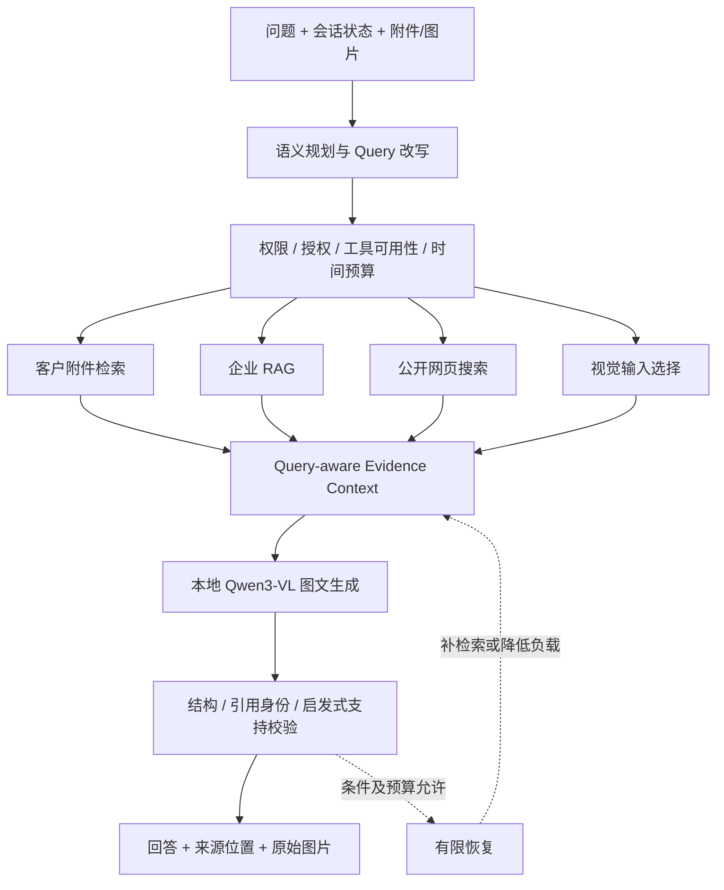

# 建材多模态 RAG Agent

面向真岩石系列产品咨询、施工技术支持与资料查询的本地知识助手。将产品资料、施工方案、节点图纸、项目案例和客户附件转为可追溯证据，由有限 Agent 选择信息来源，输出回答、引用及原始证据图片。


**核心问题：找对资料、保留关键关系、控制本机预算，并说明结论来自哪里。**



图为逻辑数据流，不表示工具并行或每题执行所有分支。实际 LangGraph 条件路由，GPU推理串行；附件图片可在生成阶段联合读取。

## 核心算法与代码

| 能力 | 实现重点 | 入口 |
|---|---|---|
| 有限 Agent | 结构化计划、Guard、真实阶段执行、有限重试、执行轨迹 | [Graph](backend/sales/answer_graph.py)、[Planner](backend/sales/tool_planner.py)、[阶段执行](backend/sales/staged_execution.py) |
| Query-aware Context | 跨来源排名归一、去重、表格行/条件/数字单位关系保护、候选冲突成组、动态预算 | [Context Engine](backend/sales/context_engine.py) |
| 混合检索 | BM25 + 本地Embedding、RRF、词法与Dense-only候选保留、Cross-Encoder重排、资源不足降级 | [Retriever](backend/sales/retriever.py)、[Dense/Reranker](backend/sales/dense_retrieval.py) |
| 多格式证据化 | PDF、DOCX、XLSX/XLS/CSV、TXT、HTML/XML、ZIP表格包、常见图片；保留格式专用位置 | [解析器](backend/document_parsing)、[Evidence V2](backend/documents/evidence_v2.py) |
| 附件隔离 | 最多4份文件；浏览器/账号绑定的进程内会话；TTL、容量限制、独立检索 | [会话](backend/documents/customer_sessions.py)、[Owner Guard](backend/documents/ownership.py) |
| 视觉与溯源 | 原图与OCR候选并列、图片哈希去重、实际输入序号、来源绑定、签名原图接口 | [视觉输入](backend/documents/visual_inputs.py)、[布局](backend/documents/visual_layout.py) |
| 校验与恢复 | Evidence白名单、服务端来源回填、数字支持审计、分阶段错误码、共享恢复预算 | [回答/校验](backend/app.py)、[错误协议](backend/sales/runtime_status.py)、[预算](backend/request_budget.py) |
| 任务记忆 | 显式启用、用户/会话隔离、相关历史召回、状态修正与撤回；记忆不当技术事实 | [Task Memory](backend/sales/task_memory.py) |

## Retrieval → Context → Model Input

```text
企业资料 → BM25 + Dense → RRF → 候选保留 → Reranker ─┐
客户附件 → 结构窗口/业务行召回 → 可选语义重排 ────────┤
公开网页 → 去重、来源/时效排序、受限正文验证 ──────────┤
图片资产 → 问题相关选择与来源绑定 ─────────────────────┘
                        ↓
        Context Engine：决定保留哪些证据和关系
                        ↓
        最终 Token / 图片预算：模型实际输入
```

- Canonical Evidence与本轮输入审计分离，单轮压缩不删除原始解析结果。
- 表格尽量按业务行召回，绑定紧凑表头，避免字段名与值分离。
- 已识别的条件、否定关系与候选冲突组参与成组打包，防止丢掉限制条件。
- 不直接比较各来源原始分数，先按来源内部排名归一，再结合问题与结构信息评分。
- 热态8B预留GPU时，企业检索跳过Dense/Reranker使用词法路径；混合检索不是每次请求的保证。

见 [算法设计](docs/ALGORITHMS.md)、[上下文策略](docs/CONTEXT_ENGINE.md)。

## 多来源与多模态

一个请求可以组合客户附件、企业知识、公开网页及实际图片。重复支持、互补支持与冲突来源应分别表述；证据不足时拒答或说明局部覆盖。

图片不是只有OCR文本：保留原始像素输入，附件路径可在一次Qwen3-VL调用中联合阅读图文。**图片被检索/返回前端，不代表像素已送入模型**，应以实际 `visual_input_manifest` 核对。

## LangGraph 与有限恢复

```text
plan_request → guard_tools → 按需工具
 → compose_evidence → generate_answer → validate_answer
 → collect_response → assess_retry → 有限重试或 finalize_response
```

- 不是每题执行所有节点，普通对话与审核产品目录存在快捷路径。
- 联网开关表示授权，不是强制搜索；失败后也不增加权限。
- 附件仅召回索引且尚未生成时，可以扩大范围一次，无需再次调用Planner。
- HTTP请求最多两次恢复、每阶段一次、不延长原deadline。
- `finalize_response`不调用模型，也不补回已裁掉的信息。
- Graph无跨进程Checkpointer，不宣传为持久化自主长任务Agent。

见 [Agent节点与审计](docs/LANGGRAPH.md)。

## 本地资源与部署

| 部分 | 当前实现 |
|---|---|
| 推理 | Qwen3-VL-8B-Instruct，NF4 4-bit，Batch Size 1 |
| 单卡预算 | GPU串行、检索/生成错峰、动态文本/图片/输出预算、部分OOM降载 |
| 空闲卸载 | 默认20分钟，可配置 |
| 前端 | Next.js / React / TypeScript；拖入、粘贴附件与自适应输入框 |
| 部署 | 腾讯云静态前端 → Tailscale HTTPS入口 → 本地FastAPI/GPU |
| 权限 | 匿名用户只查public；管理员授权internal；内部库可为空 |
| 状态 | SQLite账号/审计/可选任务记忆；客户附件仍为进程内会话 |

不包含生产地址、账号数据库、企业原始资料、客户文件、模型权重或私有索引。MIT仅覆盖代码，不授予企业资料或外部标准的使用权。

当前实际知识资料均为公开资料，internal分区只是预留的权限架构，并不表示现有库含内部保密资料。为控制仓库体积与明确资料再分发边界，公开版提供配置、解析/入库代码及虚构示例，而非整份本地数据目录。

## 快速开始

Python 3.11、Node.js 22。生成需自行准备兼容的CUDA/PyTorch、bitsandbytes和模型权重。可选OCR/FlashAttention的Windows兼容性需另行验证。

```bash
pip install -r requirements.txt
cp .env.example .env
# 设置 FACADE_MODEL_PATH，真实Key仅保存在本地环境
python -m uvicorn backend.app:app --host 127.0.0.1 --port 8000 --env-file .env
```

PowerShell用 `Copy-Item .env.example .env` 或 `./scripts/start_backend.ps1`。服务启动/健康检查不加载模型。

```bash
cd frontend
npm ci
npm run dev
```

空仓库 `/health/retrieval` 返回 `not_ready` 是预期行为，企业索引需自行从授权资料构建。

### 不加载模型的小规模校验

```bash
python scripts/public_smoke.py
python scripts/verify_public_release.py
# 对已经启动的服务校验
python scripts/public_smoke.py --base-url http://127.0.0.1:8000
```

脚本生成虚构PDF、DOCX、XLSX和PNG，验证上传、来源、原图、跨用户隔离、删除与健康接口。文件/报告在忽略的 `runtime/public_smoke/`。这不是模型答案准确率评测。

## 验证与边界

见 [本地验证记录](docs/VALIDATION.md)、[评测协议](docs/EVALUATION.md)。企业历史评测数据未发布，因此不把旧召回数字作为本版可复现成绩。

- Schema、引用身份和接口200不代表语义正确；支持审计不是逐句事实证明。
- 冲突分组是候选发现，主体、期间和业务口径未保证完全对齐。
- 扫描与视觉有页数、批次、像素预算，不能保证任意文件100%无损。
- 最终模型只读预算打包的子集，不读取全部原文件/历史。
- 生成质量、真实图片匹配和端到端延迟需授权资料实测，无固定全题两分钟保证。

[完整架构](docs/ARCHITECTURE.md) · [安全说明](SECURITY.md)
