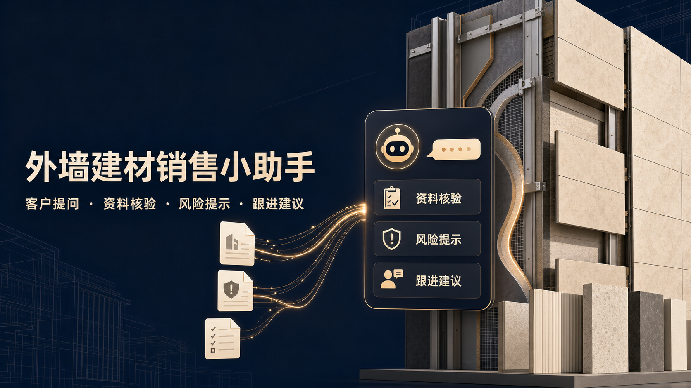
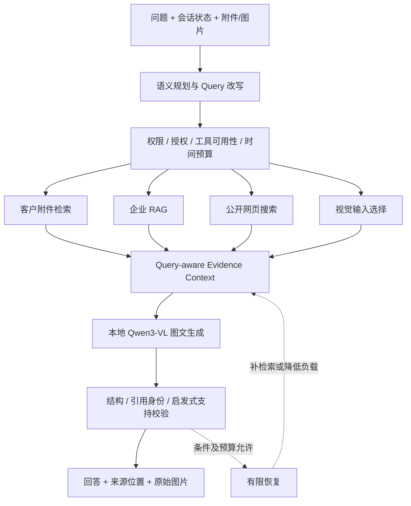

# 建材多模态 RAG Agent

面向建材销售与客户技术支持的本地多模态知识助手，当前知识场景主要围绕真岩石系列产品。将产品资料、施工方案、节点图纸、项目案例和客户附件转为可追溯证据，由有限 Agent 选择信息来源，输出回答、引用及原始证据图片。



**核心问题：找对资料、保留关键关系、控制本机预算，并说明结论来自哪里。**

核心设计是：**三类来源分别取证 → Context决定模型看到什么 → LangGraph控制过程如何执行。** 不把所有文件塞入模型，也不把不同来源强行套入同一条检索链。

| 来源 | 处理方式 | 回答中的作用 |
|---|---|---|
| 企业本地资料 | 授权资料预先解析、分类、审核，建立长期索引和图库 | 产品参数、施工方法、项目案例 |
| 客户临时附件 | 上传后独立解析、Owner绑定、会话隔离、TTL/删除；不自动进入企业库 | 当前客户的项目条件和具体材料 |
| 公开网页 | 获得联网授权后按需搜索，去重并受限核验正文 | 外部公开事实与时效信息 |



图为逻辑数据流，不表示工具并行或每题执行所有分支。实际 LangGraph 条件路由，GPU推理串行；附件图片可在生成阶段联合读取。

## 两项核心设计

### Context：原始证据与本轮模型输入分离

系统保留原始解析内容及来源位置，只筛选当前问题的候选证据。Context Engine在CPU上结合**来源内排名、问题目标和结构关系**评分，过滤导航索引、去重，并为不同回答维度保留代表证据；随后在文本、图片和输出预算内打包已识别的表格行、数值单位、条件与冲突关系。模型读取的是本轮证据子集，不是全部原文件。这是组合评分与关系保护，不是额外压缩模型，也不保证语义无损。

机制示意（人工构造，非实测答案）：问题同时要求“厚度、适用条件及资料差异”。目录索引只用于展开正文；参数行`20 mm`与另一来源`18 mm`在实体/范围相同且冲突被识别时成组保留；“不得用于持续浸水环境”与适用条件一起打包。低相关介绍可被裁掉；若关键组也因预算被移除，应报告覆盖缺口，而不是声称完成所有分析。

### LangGraph：模型规划，后端约束执行

Planner输出工具计划、检索目标与回答要求；后端检查权限、联网许可、工具可用性及预算。`WorkflowStep`携带实际操作，`WorkflowCursor`推进阶段，LangGraph按下一阶段条件路由并执行真实工具。执行结果再进入证据整理、生成与校验。单请求最多两个恢复动作、每阶段一次，Graph最多一轮工具重执行；不会无限自主重规划，也不会通过重试扩大权限。

快捷路径可跳过模型规划；附件图片也可能直接在生成节点联合读取。SQLite会话记忆和审计不等于Graph跨进程断点恢复。

## 支撑模块与源码入口

| 能力 | 实现重点 | 入口 |
|---|---|---|
| 有限 Agent | 结构化计划、Guard、真实阶段执行、有限重试、执行轨迹 | [Graph](backend/sales/answer_graph.py)、[Planner](backend/sales/tool_planner.py)、[阶段执行](backend/sales/staged_execution.py) |
| Query-aware Context | 跨来源排名归一、去重、表格行/条件/数字单位关系保护、候选冲突成组、动态预算 | [Context Engine](backend/sales/context_engine.py) |
| 多目标与跨语言检索 | Planner一次输出来源语言Query、search targets与answer goals；目标证据重排、导航/回答Evidence分离 | [目标重排](backend/sales/goal_reranking.py)、[附件检索](backend/documents/customer_sessions.py) |
| 结构化冲突候选 | 实体＋规范化指标＋范围/版本＋单位事实键，关联不同值的证据；不自动裁定哪方正确 | [Fact Normalization](backend/sales/fact_normalization.py)、[成组打包](backend/sales/evidence_packing.py) |
| 混合检索 | BM25 + 本地Embedding、RRF、词法与Dense-only候选保留、Cross-Encoder重排、资源不足降级 | [Retriever](backend/sales/retriever.py)、[Dense/Reranker](backend/sales/dense_retrieval.py) |
| 多格式证据化 | PDF、DOCX、XLSX/XLS/CSV、TXT、HTML/XML、ZIP表格包、常见图片；保留格式专用位置 | [解析器](backend/document_parsing)、[Evidence V2](backend/documents/evidence_v2.py) |
| 附件隔离 | 最多4份文件；浏览器/账号绑定的进程内会话；TTL、容量限制、独立检索 | [会话](backend/documents/customer_sessions.py)、[Owner Guard](backend/documents/ownership.py) |
| 视觉与溯源 | 原图与OCR候选并列、图片哈希去重、实际输入序号、来源绑定、签名原图接口 | [视觉输入](backend/documents/visual_inputs.py)、[布局](backend/documents/visual_layout.py) |
| 校验与恢复 | Evidence白名单、服务端来源回填、数字支持审计、分阶段错误码、共享恢复预算 | [回答/校验](backend/app.py)、[错误协议](backend/sales/runtime_status.py)、[预算](backend/request_budget.py) |
| 任务记忆 | 显式启用、用户/会话隔离、相关历史召回、状态修正与撤回；记忆不当技术事实 | [Task Memory](backend/sales/task_memory.py) |

## Retrieval → Context → Model Input

```text
企业资料 → BM25 + Dense → RRF → 候选保留 → Reranker ─┐
客户附件 → 结构窗口/业务行召回 → 可选语义重排 ────────┤
公开网页 → 去重、来源/时效排序、受限正文验证 ──────────┤
图片资产 → 问题相关选择与来源绑定 ─────────────────────┘
                        ↓
        Context Engine：决定保留哪些证据和关系
                        ↓
        最终 Token / 图片预算：模型实际输入
```

- Canonical Evidence与本轮输入审计分离，单轮压缩不删除原始解析结果。
- 表格尽量按业务行召回，绑定紧凑表头，避免字段名与值分离。
- 已识别的条件、否定关系与候选冲突组参与成组打包，防止丢掉限制条件。
- 导航索引用于定位和展开正文，不应替代回答证据；多目标请求按目标相关性选择实际业务行/段落。
- 数值、单位和条件保护仍依赖正确召回与关系识别；修复后原题回归与剩余缺口均公开，见下文。
- 不直接比较各来源原始分数，先按来源内部排名归一，再结合问题与结构信息评分。
- 热态8B预留GPU时，企业检索跳过Dense/Reranker使用词法路径；混合检索不是每次请求的保证。

见 [算法设计](docs/ALGORITHMS.md)、[上下文策略](docs/CONTEXT_ENGINE.md)。

## 多来源与多模态

一个请求可以组合客户附件、企业知识、公开网页及实际图片。重复支持、互补支持与冲突来源应分别表述；证据不足时拒答或说明局部覆盖。

图片不是只有OCR文本：保留原始像素输入，附件路径可在一次Qwen3-VL调用中联合阅读图文。**图片被检索/返回前端，不代表像素已送入模型**，应以实际 `visual_input_manifest` 核对。

## LangGraph 与有限恢复

```text
plan_request → guard_tools → 按需工具
 → compose_evidence → generate_answer → validate_answer
 → collect_response → assess_retry → 有限重试或 finalize_response
```

- 不是每题执行所有节点，普通对话与审核产品目录存在快捷路径。
- 联网开关表示授权，不是强制搜索；失败后也不增加权限。
- 附件仅召回索引且尚未生成时，可以扩大范围一次，无需再次调用Planner。
- HTTP请求最多两次恢复、每阶段一次、不延长原deadline。
- `finalize_response`不调用模型，也不补回已裁掉的信息。
- Graph无跨进程Checkpointer，不宣传为持久化自主长任务Agent。

见 [Agent节点与审计](docs/LANGGRAPH.md)。

## 75题统一条件开发回归

同一批题目全部重跑：召回24窗口、5000 Token候选预算、768/96窗口与重叠、同一个Qwen3-VL Tokenizer、5000 Token完整Prompt预算。多证据题按**全部金标支持**计算Recall/MRR，不能命中一条就算成功；75/75打包预算通过，运行错误0。未更换失败题，不使用改写变体。

**Evidence Recall@5定义：前5条证据完整覆盖金标支持的问题比例。** 需要三条支持而只找到两条时，此题不计命中；MRR取首次获得完整支持的排名倒数。文本保留和关系识别分开测量，不宣称仅凭这些结果证明算法显著提升。

| 指标 | 统一条件实测 |
|---|---|
| 完整支持 Evidence Recall@5 | 38/45，84.44% |
| MRR（首次完整支持） | 0.5733 |
| 原生数值、目标行与单位绑定保留 | 10/10 |
| 条件/否定文本保留 | 10/10 |
| 条件保护标记 | 8/10 |
| 原生冲突检测 / 双方保留 | 5/5、5/5 |
| 人工Evidence冲突控制：检测 / 双方保留 | 5/5、5/5 |

75题包含70条原生文件案例与5条人工Evidence控制。打包条件一致，但输入类型不同，控制题不冒充原生解析成功。以上为附件检索与Context回归，**不是8B答案准确率或完整Agent成绩**。

独立补测：企业库5次真实BM25＋Dense＋RRF＋Cross-Encoder执行5/5，指定金标Top-5为4/5（已知开发探针，不是未见准确率）；扫描PDF一页识别出`CARD-DELTA`和`17 mm`、保留原图，OCR候选进入召回；5道原生负冲突控制误报0/5且双方记录保留5/5。补测不混入主集合分母。

[统一协议和结果](docs/UNIFIED_EVALUATION.md) · [逐题结果](evaluation/results/unified_75_v1.json) · [冻结配置](evaluation/results/unified_75_protocol_v1.json)

```bash
# 不需模型或下载原始文件，重算已发布指标并核对题目、代码指纹
python scripts/verify_unified_publication.py
```

以上仅核算已发布结果与指纹，不重新检索。原始链路复跑：

```bash
python scripts/prepare_public_eval.py --download
python scripts/run_unified_public_eval.py --track offline --tokenizer-path /path/to/Qwen3-VL-8B-Instruct --output outputs/public_eval/new_run
python scripts/verify_unified_public_eval.py --output outputs/public_eval/new_run
```

历史不同预算运行及修复前失败结果完整保留于[历史结果](docs/EVALUATION_RESULTS.md)和[修复回归](docs/NATIVE_RELATION_REPAIR.md)，不作为当前统一条件成绩。

## 真实本地8B端到端Demo

已实际跑3个固定案例：客户检查表＋企业资料、PDF＋Excel参数差异、示意图＋Word。保存实际工具节点、保留Evidence、图片manifest、API回答、引用与覆盖审计，并保留通用契约修复前的失败记录。[查看原件与完整执行记录](examples/real_agent_demo/README.md)。

图文案例实际回答：Panel与Support通过水平线连接；施工前核对厚度、基材和固定设计，不推断承载能力。Word内嵌图与PNG相同，SHA去重后只输入1张，manifest保留两个来源。

**3例流程完成不等于3例全对：** 联合案例产品介绍不完整，参数案例对文件差异概括不准确，视觉案例缺少显式Visual Evidence引用且观察来源标签不准确。耗时约24.6～54.2秒（首题含冷启动），仅为本次定性示范，不报告端到端准确率或P95。工具选择走附件快捷路径，不冒充本次运行了复杂LLM Planner。

```bash
python scripts/verify_real_agent_demo.py  # 仅核对公开记录和原件，不调用模型
```

## 本地资源与部署

| 部分 | 当前实现 |
|---|---|
| 推理 | Qwen3-VL-8B-Instruct，NF4 4-bit，Batch Size 1 |
| 单卡预算 | GPU串行、检索/生成错峰、动态文本/图片/输出预算、部分OOM降载 |
| 空闲卸载 | 默认20分钟，可配置 |
| 前端 | Next.js / React / TypeScript；拖入、粘贴附件与自适应输入框 |
| 部署 | 腾讯云静态前端 → Tailscale HTTPS入口 → 本地FastAPI/GPU |
| 权限 | 匿名用户只查public；管理员授权internal；内部库可为空 |
| 状态 | SQLite账号/审计/可选任务记忆；客户附件仍为进程内会话 |

不包含生产地址、账号数据库、企业原始资料、客户文件、模型权重或私有索引。MIT仅覆盖代码，不授予企业资料或外部标准的使用权。

当前实际知识资料均为公开资料，internal分区只是预留的权限架构，并不表示现有库含内部保密资料。为控制仓库体积与明确资料再分发边界，公开版提供配置、解析/入库代码及虚构示例，而非整份本地数据目录。

## 快速开始

Python 3.11、Node.js 22。生成需自行准备兼容的CUDA/PyTorch、bitsandbytes和模型权重。可选OCR/FlashAttention的Windows兼容性需另行验证。

| 用途 | 入口及边界 |
|---|---|
| 校验源码、接口和已发布结果 | `verify_public_release.py`、`public_smoke.py`、`verify_unified_publication.py`；不证明生成质量 |
| 复跑公开附件检索与Context | 准备来源文件和本地Tokenizer，再运行统一评测；不加载8B生成权重 |
| 启动完整问答 | 需要生成权重、业务索引及相应依赖；实际混合检索仍受GPU运行状态影响 |

```bash
pip install -r requirements.txt
cp .env.example .env
# 设置 FACADE_MODEL_PATH，真实Key仅保存在本地环境
python -m uvicorn backend.app:app --host 127.0.0.1 --port 8000 --env-file .env
```

PowerShell用 `Copy-Item .env.example .env` 或 `./scripts/start_backend.ps1`。服务启动/健康检查不加载模型。

```bash
cd frontend
cp .env.example .env.local
npm ci
npm run dev
```

空仓库 `/health/retrieval` 返回 `not_ready` 是预期行为，企业索引需自行从授权资料构建。

公开`.env.example`已默认开启`RAG_HYBRID_ENABLED=1`和`CUSTOMER_DOCUMENT_OCR_ENABLED=1`，检索设备为CUDA；需要本地Embedding/Reranker、指纹匹配的向量索引及缓存的OCR模型，依赖缺失时保留原文/原图并报告降级。本次另做真实混合检索和扫描页验收。8B热态预留GPU时仍可能按显存策略跳过Dense/Reranker，开启配置不代表每次都实际执行。

**CI与默认部署模式不同：** Actions的CPU作业显式关闭Hybrid/OCR及附件语义重排，用于接口与CPU降级路径校验；绿色CI不证明默认CUDA配置、真实视觉识别或8B生成通过。GPU混合检索与OCR有独立本地验收，见[验证范围](docs/VALIDATION.md)。

前端单独读取`frontend/.env.local`，PowerShell可执行`Copy-Item .env.example .env.local`；后端的`--env-file .env`不会替前端加载配置。部署时先填写HTTPS API地址，再运行`npm run build`并上传`frontend/out/`静态产物；后端`FACADE_PUBLIC_FRONTEND`填写实际前端Origin。`NEXT_PUBLIC_*`为构建期公开值，不能存放密钥。更改API地址后必须重新构建。

### 不加载模型的小规模校验

```bash
python scripts/public_smoke.py
python scripts/verify_public_release.py
# 对已经启动的服务校验
python scripts/public_smoke.py --base-url http://127.0.0.1:8000
```

脚本生成虚构PDF、DOCX、XLSX和PNG，验证上传、来源、原图、跨用户隔离、删除与健康接口。文件/报告在忽略的 `runtime/public_smoke/`。这不是模型答案准确率评测。

## 当前验证范围与限制

公开范围包括源码/接口校验、75题检索与Context回归、独立的混合检索/单页OCR/负冲突控制，以及3题真实8B定性Demo。`examples/demo_queries.json`仍是旧场景与预期，实际生成记录单独存于`examples/real_agent_demo/`；Demo不代替大规模端到端评测。

- Schema、引用身份和接口200不代表语义正确；支持审计不是逐句事实证明。
- 冲突分组是候选发现，主体、期间和业务口径未保证完全对齐。
- 扫描与视觉有页数、批次、像素预算，不能保证任意文件100%无损。
- 最终模型只读预算打包的子集，不读取全部原文件/历史。
- 生成质量、真实图片匹配和端到端延迟需授权资料实测，无固定全题两分钟保证。

[完整架构](docs/ARCHITECTURE.md) · [安全说明](SECURITY.md)
