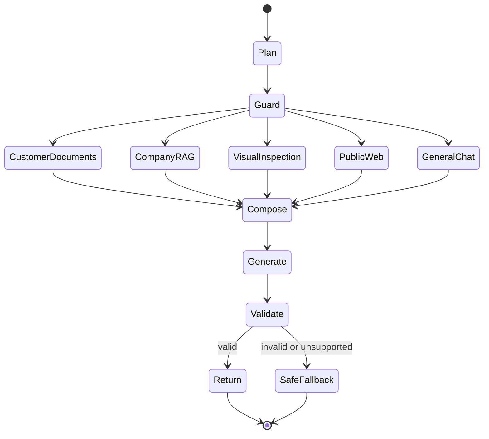

# 完整系统架构

本文描述当前建材知识助手从资料入库、在线问答到证据回传的完整数据流。核心目标不是让模型“知道更多”，而是让每条业务结论都能回到原始资料，并能定位错误发生在哪一层。

## 1. 设计边界

系统定位为小规模、多模态、多来源的建材知识问答：

- 企业知识库可包含多份长期维护的产品、工艺、节点和案例资料；
- 客户每次会话最多上传 4 份 PDF、Word、Excel、CSV 或图片；
- 本地模型负责语义计划、视觉理解和回答生成；
- Python 负责解析、检索、预算、权限、引用校验和资源回收；
- 公开搜索只补充当前外部事实，不能替代企业产品证据。

它不是无限规模网盘搜索，也不承诺对任意超长文档做全文无遗漏摘要。

## 2. 两条数据平面

### 2.1 企业知识入库平面

```text
授权原始资料
→ 格式识别与直接解析
→ 必要页面视觉回退
→ Canonical Evidence
→ 知识分类与可服务性审核
→ 文本索引 / 向量索引 / 审核图库
→ 版本与指纹冻结
```

入库采用 review-first：新文件先生成解析结果和视觉资产清单，人工确认知识分类、别名和公开范围后才进入正式索引。内部销售口径、检测结论、标准规范和项目案例使用不同的来源类型，避免在回答中混淆权威级别。

### 2.2 客户会话附件平面

```text
最多4份客户附件
→ 进程内解析
→ 会话级 Canonical Evidence
→ 问题驱动窗口与图片选择
→ Input Snapshot
→ 回答结束 / 会话超时释放
```

客户附件不会自动写入企业知识库，默认约一小时失效；私有附件内容也不会拼接到联网查询。

## 3. Canonical Evidence 协议

统一协议只统一上层接口，不抹平格式差异：

```json
{
  "document_id": "doc_xxx",
  "file_name": "example.pdf",
  "source_type": "pdf",
  "elements": [],
  "tables": [],
  "visual_assets": [],
  "source_locations": [],
  "parser_provenance": {}
}
```

位置协议：

| 格式 | 位置字段 | 典型证据单元 |
|---|---|---|
| PDF | page、bbox、section | 页面文本、局部表格、页面裁剪 |
| Word | heading、paragraph、table、header/footer | 段落、表格行、内嵌图片 |
| Excel | workbook、sheet、table、range、row、cell | 表头绑定的数据行、公式、图表源范围 |
| 图片 | visual_id、bbox、OCR候选 | 原图、文本框、表格候选 |

每个 Evidence ID 在同一索引快照中稳定，可同时服务检索、训练样本、引用验证和错误分析。

## 4. 格式专用预处理

### PDF

1. 按页检测文本层是否存在；
2. 检查乱码比例、字符密度、阅读顺序和表格错位；
3. 可靠页面优先使用原生文本和表格；
4. 扫描／乱码页面渲染为图片，进入 OCR + 版面 + 表格结构恢复；
5. 混合 PDF 按页分流，不对整份文件只做一次判断；
6. 输出页面覆盖报告，未处理页不能静默标为成功。

### Word

正文、标题、表格、页眉页脚、评论与内嵌图片分别形成 Evidence。图片保留原始资产与附近段落，不仅留下 OCR 文本。

### Excel

遍历可见 Sheet，识别一页内多个非连续表格区域。表格以完整业务行为主，每个值绑定紧凑列头和必要行上下文：

```text
[ROW] Property='Building A' | Primary space type='Office - General - 310'
```

这样既保留结构语义，又避免在每个单元格中重复整行表头造成索引膨胀。原生图表优先读取系列、公式和源单元格；图片只承担标题、图例、趋势和布局理解。

### 图片与扫描件

原图是第一等资产。OCR／PP-Structure／VLM 输出带解析器、置信度和来源位置的候选；低置信度结果不会自动成为业务事实。没有明确数据标签的图表只能支持趋势判断，不能从柱高估读精确数值。

## 5. 索引与检索

### 离线索引

- BM25 索引保存文本、表格行、来源和词项统计；
- Dense 索引保存本地 Embedding 与同一 Evidence 元数据；
- 两者记录共享内容指纹，防止旧 Dense 与新 Lexical 混用；
- Visual Gallery 保存审核图片、产品／案例／节点／工艺标签、标题、OCR 和来源页。

### 在线检索

```text
问题
→ 别名扩展与检索词保真
→ BM25 + Dense 并行候选
→ RRF 融合
→ 显式候选保留
→ Cross-Encoder 重排
→ 任务/答案形态轻量校正
→ 文本 Evidence + Visual Asset
```

显式候选保留规则保证 Lexical Top-8 和 Dense-only Top-4 不会在融合阶段被意外淘汰。产品图片请求独立访问完整审核图库，不依赖文本 Top-K 恰好携带图片。

## 6. Agent 在线状态机



Planner 输出：

```json
{
  "tools": ["company_rag"],
  "intent": "product_parameter",
  "task_type": "factual_lookup",
  "retrieval_query": "指定产品 图片",
  "target_terms": ["指定产品"],
  "product_overview": false,
  "wants_visuals": true,
  "visual_scope": "product",
  "requires_public_web": false
}
```

模型负责业务语义，Guard 只校验工具是否存在、权限是否允许、附件是否可用和外部调用是否经过授权。这样减少不断扩张的关键词硬路由，同时保留确定性的隐私与成本边界。

## 7. 上下文编排

Canonical Evidence 永远保留完整内容；Context Composer 只为当前问题创建 Input Snapshot：

1. 对每个文本／表格块按结构生成窗口；
2. 根据问题为窗口打分；
3. 先满足有相关内容文件的最低配额；
4. 全局竞争剩余 Token 预算；
5. 选择与召回 Evidence 对应的页面或图表，不固定取首页；
6. 保存实际进入模型的窗口、图片、Token 与截断审计。

客户附件当前采用 5k 文本 Token 检索预算，可在显存安全上限内配置；结构窗口约 768 Token、96 Token 重叠。字符数仅作兼容保护，不使用“每份文件永远截前 6000 字符”的正式策略。

## 8. Grounded Generation

生成模型收到：问题、会话上下文、工具计划、文本 Evidence、视觉输入顺序、公开来源及回答规则。输出必须通过 Pydantic／JSON 协议，并满足：

- 引用 ID 位于本次白名单；
- 关键事实由相应 Evidence 支持；
- 数值不能脱离证据自由生成；
- 多来源冲突不能静默选择一方；
- 证据不足时 `answerable=false`；
- 网络资料和企业资料在来源上明确区分。

校验通过后，服务器将引用物化为用户可见的来源卡片和原图接口。

## 9. GPU 状态管理

同一块 16GB GPU 不能长期同时驻留 8B VLM、Embedding 和 Reranker。资源状态机为：

```text
冷状态：检索模型按配置驻留 CPU/GPU
→ 需要生成
→ 释放检索模型 GPU 缓存并迁移到 CPU
→ 加载 Qwen3-VL-8B 4-bit
→ 串行生成
→ 空闲计时
→ 默认600秒后卸载生成模型
→ 恢复检索运行时
```

联网抓取属于网络 I/O，可以与本地检索并行；GPU 模型调用本身保持串行，避免显存峰值叠加。

## 10. 部署拓扑

```text
用户浏览器
→ 腾讯云 CloudBase 静态前端
→ Tailscale HTTPS 私网入口
→ 本地 FastAPI
→ 本地 Qwen3-VL 与私有索引
```

前端可公开访问，但本地后端不直接开放公网端口。生产地址通过构建变量注入，公开仓库不保存真实主机名。API 设置来源限制、生成请求速率限制和私有视觉资产接口。

## 11. 可观测性与错误归因

一次错误按以下顺序定位：

```text
文件是否成功解析
→ Gold文件是否进入候选
→ Gold Evidence是否召回
→ Gold视觉资产是否进入Input Snapshot
→ 模型是否正确理解
→ 输出是否通过引用校验
```

主要审计对象包括解析覆盖报告、索引指纹、召回分数、工具计划、Input Snapshot、模型原始 JSON、物化引用、延迟和峰值显存。只有 Gold Evidence 已进入输入后，错误才主要归因于模型理解或生成。

## 12. 安全与公开边界

- 企业原文、客户附件、模型权重、索引和密钥不提交到 Git；
- 客户附件按会话隔离，不自动进入长期知识库；
- 网络工具只接收当前公开问题，不接收私有 Evidence；
- 视觉相似只生成候选，不能证明品牌、真伪或工程适用性；
- 内部比较口径必须标明来源性质，不能冒充国家标准或第三方检测结论。
