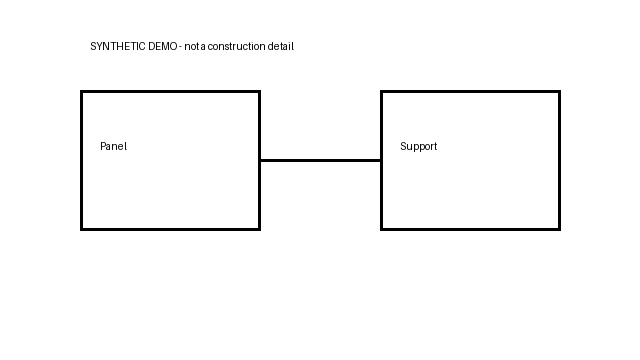

# 真实本地8B端到端执行记录

2026-09-17，通过本机HTTP服务实际上传PDF、DOCX、XLSX及PNG，再请求Qwen3-VL-8B-Instruct（NF4 4-bit）回答。**3个定性案例，不是准确率评测，也不是3个全对案例。** 未联网、未调用LLM Judge；附件为自建虚构资料，企业来源使用本机已审核公开资料库。

[修复后实际记录](after_contract_fix/execution_records.json) · [修复前失败记录](before_contract_fix/execution_records.json) · [示意图](after_contract_fix/assets/sample_drawing.png)

## 一条可检查的图文链路

问题：根据上传示意图描述Panel与Support的可见关系，并根据Word列出核对事项，不推断承载能力或合规性。



| 阶段 | 实际记录 |
|---|---|
| 工具计划 | `customer_documents`，`explicit_attachment_semantics_fast_path`；本题未执行LLM Planner |
| 保留文本 | `U1, U2, V1, U5, U3, U4, V2`（详细审计以JSON为准） |
| 实际图片 | SHA去重后1张；manifest同时绑定Word内嵌图片`V1`和PNG`V2`，不是两张不同图片 |
| 模型回答 | 描述Panel与Support通过水平线连接；列出厚度、基材、固定设计三项核对事项，未推断承载能力 |
| 引用及缺口 | 返回Word的`U1–U4`来源；未显式引用`V1/V2`，视觉引用覆盖审计为false；观察标签错误写成`direct_upload`，实际origin是`retrieved_asset` |
| 请求耗时 | 24.646秒，包含上传/解析/回答，非纯生成耗时 |

原始回答、工具节点耗时、kept Evidence、实际图片manifest、引用和审计均见JSON。这里展示完整路径的实际行为，**不会把有缺口的引用标成完全正确**。

## 三个案例与内容复核

| 案例 | 工具 | 修复后耗时 | 流程与内容结论 |
|---|---|---|---|
| 客户检查表＋企业资料 | 附件＋企业RAG | 54.223秒 | 返回回答及双方引用；企业召回偏向标准，未完整介绍真岩石具体产品。空回答维度的coverage=true不证明满足全部问题要求 |
| PDF＋Excel参数差异 | 附件 | 28.731秒 | 读取20mm/18mm及Excel版本A/B；两文件都包含这两个值，回答“两个文件的厚度数值不同”不够准确，应比较记录/版本而非断言文件间冲突；图片观察还把第2页修订说明归于第1张图 |
| 示意图＋Word | 附件图文联合 | 24.646秒 | 可见连线和核对事项正确；视觉Evidence引用不完整，观察来源标签仍有问题 |

三例HTTP均200且实际运行生成；修复后无结构化运行错误，不等于语义全对、完整引用或Planner准确率。工具计划均走附件快捷路径，本次不证明复杂请求的模型规划效果。首题包含冷态加载，不能据此声称生产P95。

## 本次发现与通用修复

第一次使用更新后服务，三例都返回`GROUNDING_FAILED`。单元复现发现：覆盖Prompt要求`answer_aspect_coverage`，旧严格字段集合却拒绝它。修复将该字段作为受限可选扩展，检查其类型、索引、状态、引用ID等；未知顶层字段和非法引用仍拒绝。**未改排序、模型、问题、原件字节或上下文预算。**

相同3题、相同4份原件SHA再次执行，三例均能返回回答。6项新增契约测试通过；331项源码回归277通过、54依赖跳过、0失败。75题离线原题复跑指标未变。修复前记录保留，不以成功记录替换失败历史。

旧服务9月13日启动，最初一次探测不作为当前版本演示。发布记录来自核实身份并重启后的9月17日服务；实际服务运行源工作区，公开版有命名空间裁剪，代码指纹分别记录，不声称两者字节相同。当前库虽均为公开资料，完整企业索引并未再分发，联合案例不保证空仓库能输出同样企业内容。

## 复跑

先按根README启动模型与所需业务索引，然后运行（本地、串行，需显存和推理时间）：

```bash
python scripts/run_real_agent_demo.py --fixtures-dir examples/real_agent_demo/after_contract_fix/assets --output runtime/real_demo_new_run
```

如服务运行另一个源工作区，显式传`--source-root`记录正确源码指纹。脚本不能仅凭HTTP判断运行进程版本，需调用者先确认/重载服务。没有企业库时联合案例可能无企业结果，应保留该缺口。脚本拒绝复用输出目录；原始响应仅存忽略的runtime，含Owner/session/签名URL等，不应直接提交。

发布前人工确认来源内容可公开，再用`export_real_agent_demo.py --reviewed-public-content`导出受限字段。公开摘要不含会话/请求身份、签名票据、本地路径和原始模型输出；Evidence excerpt限160字符，**不是模型完整输入快照**。JSON里`customer_reply`是校验/后处理后的实际API回答，非未经处理的模型原文。

```bash
python scripts/verify_real_agent_demo.py
```

该命令只检查固定文件SHA、问题与前后对照记录一致性，不调用模型，也不评判自然语言是否正确。
